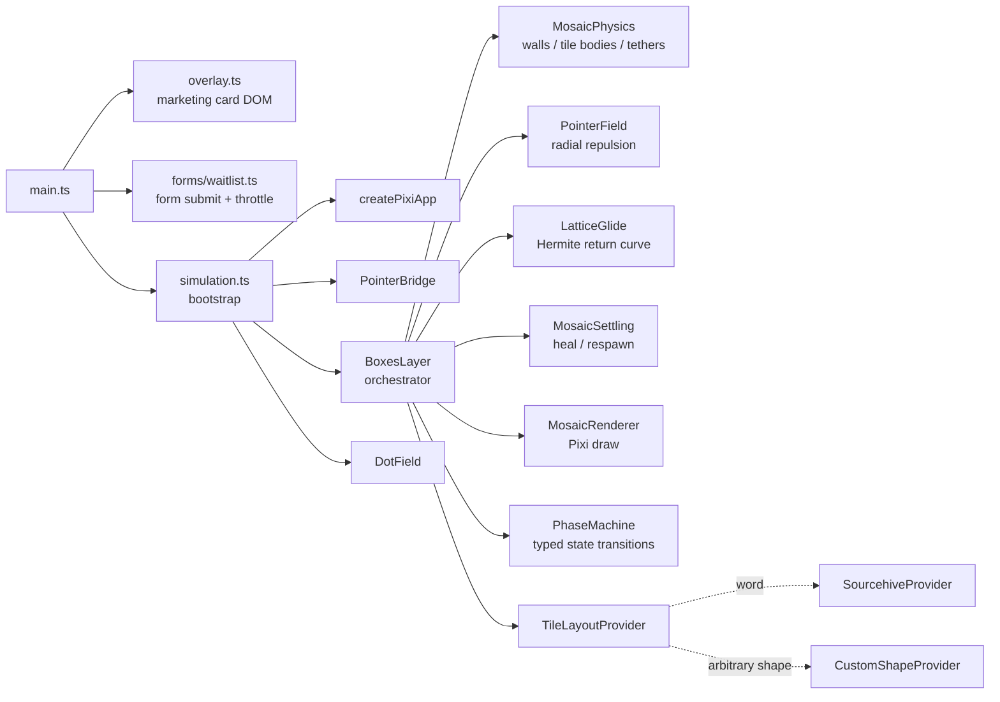
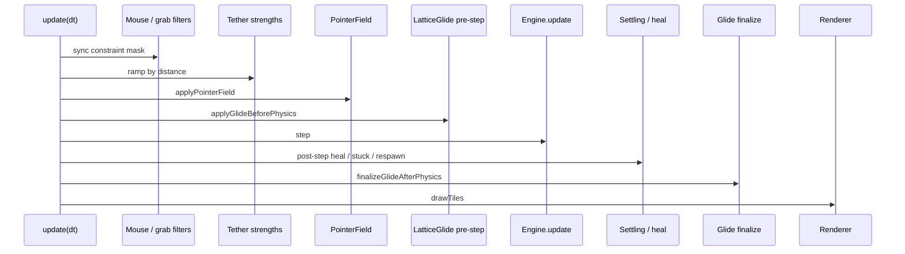

<div align="center">

# parkingpage-comingsoon

**A drop-in, production-grade "coming soon" page** with an interactive WebGL background, draggable physics typography, an email waitlist, and a hardened static-site build pipeline.

[](https://vitejs.dev/)
[](https://www.typescriptlang.org/)
[](https://pixijs.com/)
[](https://brm.io/matter-js/)
[](#license)
[](#deploy-to-render)

<sub>Fullscreen Pixi canvas - particle dot field with logo glyphs - draggable Matter.js mosaic that spells your brand - waitlist form posted to Formspree / Getform - reduced-motion fallback - CSP-hardened bundle.</sub>

</div>

---

## Table of contents

- [Why this template](#why-this-template)
- [Demo](#demo)
- [Quick start](#quick-start)
- [Customize for your brand](#customize-for-your-brand)
  - [Copy & messaging](#1-copy--messaging)
  - [The mosaic word](#2-the-mosaic-word)
  - [Logo / favicon glyph](#3-logo--favicon-glyph)
  - [Colors & typography](#4-colors--typography)
  - [Waitlist endpoint](#5-waitlist-endpoint)
- [Deploy](#deploy)
  - [Render](#deploy-to-render)
  - [Netlify / Vercel / Cloudflare Pages / S3+CloudFront](#deploy-anywhere-else)
- [Architecture](#architecture)
- [Configuration reference](#configuration-reference)
- [Scripts](#scripts)
- [Reduced motion & accessibility](#reduced-motion--accessibility)
- [Security headers / CSP](#security-headers--csp)
- [Performance notes](#performance-notes)
- [Troubleshooting](#troubleshooting)
- [Project layout](#project-layout)
- [Contributing](#contributing)
- [License](#license)

---

## Why this template

Most "coming soon" templates are a centered logo and a single email field. This one is built like an actual product:

- **Real interaction.** A physics-driven mosaic of your brand word + a particle field that responds to the cursor. Not a video - real Pixi v8 + Matter.js, ~120 KB gzip total.
- **Real waitlist.** A typed form module wired to Formspree or Getform, with double-submit throttling, CSP-safe error reporting, and an explicit "disabled" state when no endpoint is configured.
- **Real engineering.** Strict TypeScript (`noUncheckedIndexedAccess`), ESLint + Prettier, build-time CSP injection, dead-code-free, modular Pixi pipeline (mosaic / glide / pointer field / settling / renderer split). Every interactive system can be swapped or removed in isolation.
- **Real deploy story.** First-class Render Blueprint (`render.yaml`), works equally well on Netlify / Vercel / Cloudflare Pages / S3.
- **Reduced-motion friendly.** `prefers-reduced-motion: reduce` tears down the canvas and shows a static gradient backdrop; copy + form remain reachable.

If you want a parking page that doesn't *feel* like a parking page, this is a good starting point.

---

## Demo

Live: **[sourcehive.ai](https://sourcehive.ai/)**
*(The reference deploy of this template.)*

> 
> Add your own screenshot at `docs/screenshot.png` (`1280x800` works well). Until then, the link above shows you what you're getting.

---

## Quick start

Requirements: **Node.js 22+** (LTS), npm.

```bash
git clone https://github.com/<you>/parkingpage-comingsoon.git
cd parkingpage-comingsoon
cp .env.example .env          # optional - set VITE_FORM_ENDPOINT here
npm ci
npm run dev
```

Open **http://localhost:5173**. The dev server also binds to your LAN (`host: true` in [`vite.config.ts`](vite.config.ts)), so you can preview from your phone at `http://<your-lan-ip>:5173`.

To exercise the production bundle locally:

```bash
npm run build
npm run preview                # http://localhost:4173
```

---

## Customize for your brand

The five files below are everything most people need to touch.

### 1. Copy & messaging

All visible strings live in **[`src/copy/researchMessaging.ts`](src/copy/researchMessaging.ts)** as a single frozen object:

```ts
export const messaging = Object.freeze({
  brandName: 'Acme',
  tagline: "Tomorrow's logistics, today.",
  lede: 'Long-form paragraph...\n(\\n becomes a real line break)',
  bullets: Object.freeze([
    'First value prop.',
    'Second value prop.',
    'Third value prop.',
  ]),
  waitlistTitle: 'Get launch updates',
  waitlistHelper: 'Your email is only used for launch updates...',
  waitlistStatus: Object.freeze({ /* ...form status copy... */ }),
});
```

There is **no CMS** by design - the bundle is a single static HTML file plus assets. Edit the file, redeploy.

### 2. The mosaic word

The interactive mosaic (the big draggable letters in the background) is generated from a 5x7 dot-matrix font. Change the word in **[`src/render/blockLetters/rasterWordMask.ts`](src/render/blockLetters/rasterWordMask.ts)**:

```ts
export const SOURCEHIVE_WORD = 'ACME' as const;
```

The mosaic auto-centers, scales to **`MOSAIC_WIDTH_FRAC = 0.9`** of the viewport, and spawns one Matter.js body per filled cell. Anything that fits the 5x7 font (uppercase A-Z, 0-9, basic glyphs already mapped in [`dotMatrix5x7.ts`](src/render/blockLetters/dotMatrix5x7.ts)) works out of the box. Add new glyphs by extending that map.

If you want a totally different shape (a logo, a non-text outline, mixed tile sizes), the engine is already decoupled - drop in the included **`CustomShapeProvider`** at [`src/render/mosaic/providers/CustomShapeProvider.ts`](src/render/mosaic/providers/CustomShapeProvider.ts) and pass it to `BoxesLayer`. See [Architecture](#architecture).

### 3. Logo / favicon glyph

Replace **`public/favicon.png`** with your own (square PNG, ~512x512 looks good). The same file is:

1. The browser tab favicon (`<link rel="icon">` in [`index.html`](index.html)).
2. The glyph sprinkled across the dot field (~1 in every 200 dots).

A `public/favicon.svg` is also included if you prefer vector; replace both for the cleanest result.

### 4. Colors & typography

CSS custom properties at the top of **[`src/style.css`](src/style.css)** drive the palette:

```css
:root {
  --bg-deep: #020203;
  --text: #f6f7f9;
  --muted: rgba(198, 200, 210, 0.88);
  --focus-ring: rgba(255, 210, 150, 0.92);
  /* ... */
}
```

The Pixi canvas background color is set in **[`src/render/createApp.ts`](src/render/createApp.ts)** (`backgroundColor: 0x020203`) - keep it close to `--bg-deep` so the static-fallback transition is invisible.

### 5. Waitlist endpoint

Pick a provider, paste the URL into `.env` (locally) and into your host's environment variables (in production):

```env
# .env (or Render dashboard, Netlify env, etc.)
VITE_FORM_ENDPOINT=https://formspree.io/f/abcdEFGH
```

Supported out of the box:

| Provider | URL shape |
|---|---|
| **Formspree** | `https://formspree.io/f/<your-form-id>` |
| **Getform** | `https://getform.io/f/<your-endpoint>` |

The submit handler ([`src/forms/waitlist.ts`](src/forms/waitlist.ts)) is provider-agnostic - any endpoint that accepts a `multipart/form-data` POST and returns JSON works. If `VITE_FORM_ENDPOINT` is missing, the form renders **disabled** with neutral copy (no broken submit on prod).

`VITE_*` values are inlined at build time, so changing the env var requires a rebuild/redeploy.

---

## Deploy

### Deploy to Render

A blueprint is included at **[`render.yaml`](render.yaml)**:

```yaml
services:
  - type: web
    runtime: static
    buildCommand: npm ci && npm run build
    staticPublishPath: ./dist
    envVars:
      - key: NODE_VERSION
        value: "22"
      - key: VITE_FORM_ENDPOINT
        sync: false
```

**Steps:**

1. Push this repo to GitHub.
2. In the Render dashboard, **New > Blueprint** and point it at the repo.
3. Set `VITE_FORM_ENDPOINT` in the service's environment.
4. (Optional) Add `X-Frame-Options: DENY` and any other security headers in **Settings > HTTP Headers** - meta-CSP cannot enforce framing.

Subsequent commits to the branch redeploy automatically.

### Deploy anywhere else

The output is plain static files in `dist/`. Anything that serves a folder works:

| Host | Build command | Publish dir |
|---|---|---|
| **Netlify** | `npm ci && npm run build` | `dist` |
| **Vercel** | (auto, framework: "Other") | `dist` |
| **Cloudflare Pages** | `npm ci && npm run build` | `dist` |
| **GitHub Pages** | `npm ci && npm run build` | `dist` |
| **S3 + CloudFront** | `npm run build` then `aws s3 sync dist/ s3://...` | n/a |

For non-root deploys (e.g. `https://example.com/coming-soon/`), set Vite's [`base`](https://vitejs.dev/config/shared-options.html#base) in `vite.config.ts` and the path-aware favicon loader in [`DotField.ts`](src/render/layers/DotField.ts) will pick it up automatically.

---

## Architecture



Per-frame pipeline inside [`BoxesLayer.update`](src/render/layers/BoxesLayer.ts):



Key seams for power users:

- **`TileLayoutProvider`** (`src/render/mosaic/types.ts`) - any `{x,y,sizeCss,id}[]` becomes a mosaic. The `SourcehiveProvider` is just one implementation.
- **`PhaseMachine`** - `bound | falling | returning` transitions are typed and validated; throws in dev, warns in prod.
- **`PointerField` / `LatticeGlide` / `MosaicSettling`** - all tunables live as named constants at the top of their file. Tweak in isolation.

---

## Configuration reference

| Where | What | Notes |
|---|---|---|
| `src/copy/researchMessaging.ts` | All visible copy | Single frozen object |
| `src/render/blockLetters/rasterWordMask.ts` | `SOURCEHIVE_WORD`, mosaic width fraction | Up to ~10 chars renders nicely |
| `src/render/blockLetters/dotMatrix5x7.ts` | 5x7 glyph map | Add letters/symbols here |
| `src/render/createApp.ts` | Pixi background color, resolution cap | `Math.min(devicePixelRatio, 2)` by default |
| `src/render/layers/DotField.ts` | Dot count, glyph density, sizes, repulsion | `DEFAULT_DOT_TUNING` at top |
| `src/render/mosaic/PointerField.ts` | Cursor force radius, falloff, speed scaling | |
| `src/render/mosaic/LatticeGlide.ts` | Spawn / return curve thresholds | |
| `src/render/mosaic/MosaicSettling.ts` | Tether stiffness/damping bands, respawn timeouts | |
| `src/style.css` | CSS variables, glass card layout | |
| `vite.config.ts` | Build-time CSP, dev/preview ports | |
| `.env` | `VITE_FORM_ENDPOINT` | Inlined at build |
| `render.yaml` | Render Blueprint | Node 22 pinned |

---

## Scripts

| Command | What |
|---|---|
| `npm run dev` | Vite dev server (port 5173, LAN-exposed) |
| `npm run build` | `tsc` + `vite build` -> static bundle in `dist/` |
| `npm run preview` | Serve the production bundle (port 4173) |
| `npm run typecheck` | `tsc --noEmit` (`strict` + `noUncheckedIndexedAccess`) |
| `npm run lint` | ESLint with `--max-warnings 0` |
| `npm run format` | Prettier check |
| `npm run format:fix` | Prettier write |

---

## Reduced motion & accessibility

- The OS preference `prefers-reduced-motion: reduce` is honored: the Pixi canvas is torn down and a static gradient (`#static-fallback`) is shown instead. JS toggles a single `body.reduced-motion` class; a no-JS `@media` query at the bottom of [`style.css`](src/style.css) covers the case where JS hasn't loaded yet.
- All copy renders in plain DOM, in document order, before the canvas - screen readers and keyboard users get the marketing card and the waitlist form unaffected.
- `aria-hidden="true"` is set on the decorative canvas + scrim layers.
- The waitlist input has an `sr-only` label and an `aria-live="polite"` status region.
- Focus rings use `--focus-ring` and respect `:focus-visible`.

---

## Security headers / CSP

A production-only Content-Security-Policy is injected as a `<meta http-equiv>` tag at build time by a Vite plugin in [`vite.config.ts`](vite.config.ts):

```text
default-src 'self';
script-src  'self' 'unsafe-eval' blob:;
worker-src  'self' blob:;
style-src   'self' 'unsafe-inline';
img-src     'self' data: blob:;
font-src    'self' data:;
connect-src 'self' https:;
base-uri    'self';
form-action 'self';
object-src  'none';
```

Notes:

- `'unsafe-eval'` is **required** by Pixi v8's `RenderTargetSystem` / `UboSystem`, which build accessor functions with `new Function(...)`. The 8.18.x package does not expose the official `pixi.js/unsafe-eval` opt-in shim as a subpath import, so allowing eval in CSP is the pragmatic fix.
- `frame-ancestors` is intentionally omitted - browsers ignore it when delivered via `<meta>`. Set it as a real HTTP header (or `X-Frame-Options: DENY`) in your host's headers panel for clickjacking protection.
- Dev server ships **no** CSP - Vite HMR needs eval-style module replacement and `ws://`.
- To restrict `connect-src` to a single form host, edit the `PROD_CSP` array in [`vite.config.ts`](vite.config.ts) and replace `https:` with the explicit endpoint origin.

---

## Performance notes

- Single backbuffer, hardware-accelerated WebGL, antialiased, capped at `devicePixelRatio = 2`.
- ~4,500 dots + a SOURCEHIVE-sized mosaic (~210 tiles) at a steady **60 fps** on a 2019 MacBook Pro / mid-tier mobile GPUs.
- Pointer trail uses preallocated `Float64Array` ring buffers (no per-frame `Array.shift` allocations).
- Canvas `getBoundingClientRect()` is cached behind a `ResizeObserver` so pointer-move handlers are O(1).
- Single `dt` cap (`32 ms`) shared between physics and dot field - bounded behavior across 30 Hz ticks and tab-switch backlogs.
- Anchor cache is rebuilt only on viewport resize, not every frame; `Body -> TileRecord` lookups go through a `WeakMap` instead of `Array.find()`.

---

## Troubleshooting

| Symptom | Likely cause | Fix |
|---|---|---|
| Marketing card shows but **no canvas / no tiles** in production | CSP blocked `unsafe-eval` (Pixi shaders) | Make sure `script-src` in `vite.config.ts` includes `'unsafe-eval'` (default does). Rebuild + redeploy. |
| `'frame-ancestors' is ignored when delivered via a <meta> element` warning | Browsers don't enforce `frame-ancestors` from meta | Move it to a real HTTP header or use `X-Frame-Options: DENY`. |
| Form button is greyed out and submission does nothing | `VITE_FORM_ENDPOINT` was empty at build time | Set it in your host's env vars and **redeploy** (it's compile-time inlined). |
| Dot field favicons missing in production | `/favicon.png` not at site root (deploy under a subpath) | Set Vite's `base` to your subpath; a fallback inline 1x1 PNG kicks in automatically so the rest of the page is unaffected. |
| Page is empty in OS dark/reduced-motion test | Reduced-motion is on; canvas intentionally hidden | This is by design. Toggle the OS setting to verify motion still works. |
| Local `npm run dev` works but prod build doesn't | Different code paths only run in prod (CSP, minification, asset URLs) | Reproduce with `npm run build && npm run preview` - same CSP, same asset paths. |

---

## Project layout

```
.
├─ index.html                # entry; Vite injects bundles + CSP at build
├─ public/
│  ├─ favicon.png            # also used as glyph in the dot field
│  └─ favicon.svg
├─ src/
│  ├─ main.ts                # mount overlay + waitlist + (optional) simulation
│  ├─ overlay.ts             # marketing card DOM
│  ├─ simulation.ts          # Pixi/Matter bootstrap
│  ├─ style.css              # CSS variables + layout
│  ├─ copy/
│  │  └─ researchMessaging.ts  # ALL visible strings
│  ├─ forms/
│  │  └─ waitlist.ts         # POST + throttle + status copy
│  ├─ render/
│  │  ├─ createApp.ts        # Pixi.Application init
│  │  ├─ canvasRect.ts       # cached getBoundingClientRect
│  │  ├─ coords.ts
│  │  ├─ physicsViewport.ts
│  │  ├─ pointerBridge.ts    # global pointer -> Pixi space
│  │  ├─ blockLetters/
│  │  │  ├─ dotMatrix5x7.ts  # glyph map
│  │  │  ├─ rasterWordMask.ts# SOURCEHIVE_WORD lives here
│  │  │  └─ sourcehiveLayout.ts
│  │  ├─ layers/
│  │  │  ├─ BoxesLayer.ts    # mosaic orchestrator
│  │  │  └─ DotField.ts      # particle + glyph background
│  │  └─ mosaic/             # split engine: physics, glide, field, settling, renderer, phase machine
│  └─ vite-env.d.ts
├─ vite.config.ts            # build-time CSP plugin + dev/preview ports
├─ render.yaml               # Render Blueprint
├─ tsconfig.json             # strict + noUncheckedIndexedAccess
├─ eslint.config.js
└─ .prettierrc.json
```

---

## Contributing

This template is intentionally small and opinionated, but PRs are welcome - especially:

- Additional `dotMatrix5x7` glyphs (lowercase, more punctuation).
- Additional `TileLayoutProvider` examples (logo outlines, SVG-path importer).
- Additional waitlist providers (ConvertKit, Mailchimp, custom backends).

Before submitting:

```bash
npm run typecheck
npm run lint
npm run build
```

All three should pass. Keep diffs focused; new features should land behind their own provider/module rather than inside `BoxesLayer` or `DotField`.

---

## License

MIT - see [`LICENSE`](LICENSE) (add one if you fork; the upstream repo is private). You're free to use this for commercial parking pages, white-label it for clients, or rip out the engine and use it elsewhere. Attribution appreciated, not required.
