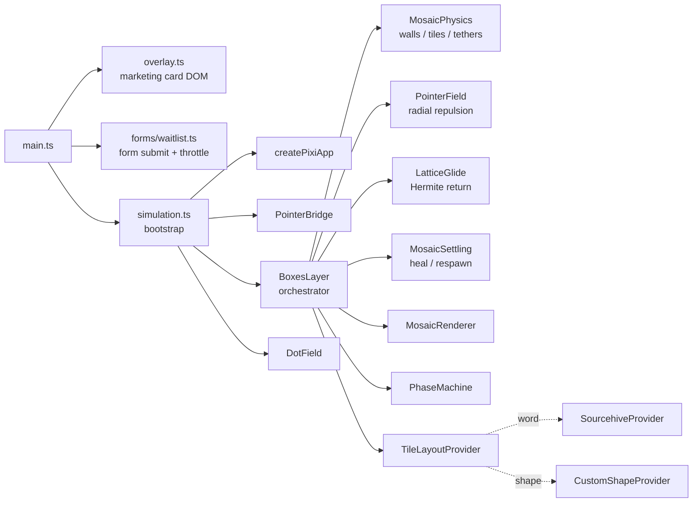

<div align="center">

# parkingpage-comingsoon

**A drop-in, production-grade "coming soon" page** with an interactive WebGL background, draggable physics typography, an email waitlist, and a hardened static-site build pipeline.

[](https://vitejs.dev/)
[](https://www.typescriptlang.org/)
[](https://pixijs.com/)
[](https://brm.io/matter-js/)
[](#license)
[](#deploy-to-render)

</div>

---

## Table of contents

- [Quick start](#quick-start)
- [Customize](#customize)
- [Deploy](#deploy)
- [Architecture](#architecture)
- [Configuration reference](#configuration-reference)
- [Scripts](#scripts)
- [Reduced motion & accessibility](#reduced-motion--accessibility)
- [Security headers / CSP](#security-headers--csp)
- [Troubleshooting](#troubleshooting)
- [Project layout](#project-layout)
- [License](#license)

---

## Quick start

Requirements: **Node.js 22+** (LTS), npm.

```bash
git clone https://github.com/<you>/parkingpage-comingsoon.git
cd parkingpage-comingsoon
cp .env.example .env          # optional - set VITE_FORM_ENDPOINT here
npm ci
npm run dev                   # http://localhost:5173 (also LAN-exposed)
```

Production bundle locally:

```bash
npm run build && npm run preview   # http://localhost:4173
```

---

## Customize

Five files cover everything most people need to touch.

### 1. Copy

All visible strings live in **[`src/copy/researchMessaging.ts`](src/copy/researchMessaging.ts)**:

```ts
export const messaging = Object.freeze({
  brandName: 'Acme',
  tagline: "Tomorrow's logistics, today.",
  lede: 'Long paragraph...\n(\\n becomes a real line break)',
  bullets: Object.freeze(['Value prop 1.', 'Value prop 2.', 'Value prop 3.']),
  waitlistTitle: 'Get launch updates',
  waitlistHelper: 'Your email is only used for launch updates...',
  waitlistStatus: Object.freeze({ /* status copy */ }),
});
```

No CMS by design - edit the file, redeploy.

### 2. The mosaic word

The big draggable letters in the background. Edit **[`src/render/blockLetters/rasterWordMask.ts`](src/render/blockLetters/rasterWordMask.ts)**:

```ts
export const SOURCEHIVE_WORD = 'ACME' as const;
```

Auto-centers, scales to 90% of viewport width, and spawns one Matter.js body per filled cell. Anything that fits the 5x7 font (uppercase A-Z, 0-9 - see [`dotMatrix5x7.ts`](src/render/blockLetters/dotMatrix5x7.ts)) works. Add new glyphs by extending that map.

For a totally different shape (a logo, an SVG outline, mixed tile sizes), use the included **`CustomShapeProvider`** at [`src/render/mosaic/providers/CustomShapeProvider.ts`](src/render/mosaic/providers/CustomShapeProvider.ts) and pass it to `BoxesLayer` instead of `SourcehiveProvider`.

### 3. Logo / favicon glyph

Replace **`public/favicon.png`** (square PNG, ~512x512). The same file is the browser tab icon and the glyph sprinkled across the dot field. A `public/favicon.svg` is also used; replace both.

### 4. Colors & typography

CSS custom properties at the top of **[`src/style.css`](src/style.css)**:

```css
:root {
  --bg-deep: #020203;
  --text: #f6f7f9;
  --muted: rgba(198, 200, 210, 0.88);
  --focus-ring: rgba(255, 210, 150, 0.92);
  /* ... */
}
```

The Pixi canvas background color is set in **[`src/render/createApp.ts`](src/render/createApp.ts)** (`backgroundColor: 0x020203`) - keep it close to `--bg-deep` so the static-fallback transition is invisible.

### 5. Waitlist endpoint

Pick a provider, set the URL in `.env` locally and in your host's environment variables in production:

```env
VITE_FORM_ENDPOINT=https://formspree.io/f/abcdEFGH
```

| Provider | URL shape |
|---|---|
| **Formspree** | `https://formspree.io/f/<your-form-id>` |
| **Getform** | `https://getform.io/f/<your-endpoint>` |

The submitter ([`src/forms/waitlist.ts`](src/forms/waitlist.ts)) is provider-agnostic - any endpoint that accepts a `multipart/form-data` POST and returns JSON works. If `VITE_FORM_ENDPOINT` is empty, the form renders **disabled** with neutral copy.

`VITE_*` values are inlined at build time, so changing the env var requires a rebuild/redeploy.

---

## Deploy

### Deploy to Render

Blueprint included at **[`render.yaml`](render.yaml)**:

```yaml
services:
  - type: web
    runtime: static
    buildCommand: npm ci && npm run build
    staticPublishPath: ./dist
    envVars:
      - { key: NODE_VERSION, value: "22" }
      - { key: VITE_FORM_ENDPOINT, sync: false }
```

In the dashboard: **New > Blueprint**, point at the repo, set `VITE_FORM_ENDPOINT` in env. Optionally add `X-Frame-Options: DENY` in **Settings > HTTP Headers** (meta-CSP cannot enforce framing).

### Deploy anywhere else

Output is plain static files in `dist/`. Anything that serves a folder works:

| Host | Build command | Publish dir |
|---|---|---|
| **Netlify** | `npm ci && npm run build` | `dist` |
| **Vercel** | (auto, framework: "Other") | `dist` |
| **Cloudflare Pages** | `npm ci && npm run build` | `dist` |
| **GitHub Pages** | `npm ci && npm run build` | `dist` |
| **S3 + CloudFront** | `npm run build` then `aws s3 sync dist/ s3://...` | n/a |

For non-root deploys (e.g. `https://example.com/coming-soon/`), set Vite's [`base`](https://vitejs.dev/config/shared-options.html#base) in `vite.config.ts`; the path-aware favicon loader in [`DotField.ts`](src/render/layers/DotField.ts) picks it up automatically.

---

## Architecture



Key seams:

- **`TileLayoutProvider`** (`src/render/mosaic/types.ts`) - any `{x,y,sizeCss,id}[]` becomes a mosaic.
- **`PhaseMachine`** - `bound | falling | returning` transitions are typed (throws in dev, warns in prod).
- **`PointerField` / `LatticeGlide` / `MosaicSettling`** - tunables live as named constants at the top of each file.

---

## Configuration reference

| Where | What |
|---|---|
| `src/copy/researchMessaging.ts` | All visible copy |
| `src/render/blockLetters/rasterWordMask.ts` | Mosaic word, width fraction |
| `src/render/blockLetters/dotMatrix5x7.ts` | 5x7 glyph map |
| `src/render/createApp.ts` | Pixi background color, resolution cap |
| `src/render/layers/DotField.ts` | Dot count, glyph density, repulsion |
| `src/render/mosaic/PointerField.ts` | Cursor force radius, falloff |
| `src/render/mosaic/LatticeGlide.ts` | Spawn / return curve thresholds |
| `src/render/mosaic/MosaicSettling.ts` | Tether bands, respawn timeouts |
| `src/style.css` | CSS variables, layout |
| `vite.config.ts` | Build-time CSP, dev/preview ports |
| `.env` | `VITE_FORM_ENDPOINT` |
| `render.yaml` | Render Blueprint |

---

## Scripts

| Command | What |
|---|---|
| `npm run dev` | Vite dev server (5173, LAN-exposed) |
| `npm run build` | `tsc` + `vite build` -> `dist/` |
| `npm run preview` | Serve the production bundle (4173) |
| `npm run typecheck` | `tsc --noEmit` (`strict` + `noUncheckedIndexedAccess`) |
| `npm run lint` | ESLint, `--max-warnings 0` |
| `npm run format` / `format:fix` | Prettier check / write |

---

## Reduced motion & accessibility

- `prefers-reduced-motion: reduce` tears down the canvas and shows a static gradient (`#static-fallback`); JS toggles a single `body.reduced-motion` class. A no-JS `@media` query in [`style.css`](src/style.css) covers the case where JS hasn't loaded yet.
- Copy renders in plain DOM, in document order, before the canvas - screen readers and keyboard users get the marketing card and waitlist form unaffected.
- `aria-hidden="true"` on canvas + scrim layers; `sr-only` label on the email input; `aria-live="polite"` status region.

---

## Security headers / CSP

A production-only CSP is injected as a `<meta http-equiv>` tag at build time by a Vite plugin in [`vite.config.ts`](vite.config.ts):

```text
default-src 'self';
script-src  'self' 'unsafe-eval' blob:;
worker-src  'self' blob:;
style-src   'self' 'unsafe-inline';
img-src     'self' data: blob:;
font-src    'self' data:;
connect-src 'self' https:;
base-uri    'self';
form-action 'self';
object-src  'none';
```

- `'unsafe-eval'` is **required** by Pixi v8's `RenderTargetSystem` / `UboSystem` (build-time `new Function(...)` for shader accessors). The 8.18.x package does not expose the `pixi.js/unsafe-eval` shim as a subpath import, so allowing eval is the pragmatic fix.
- `frame-ancestors` is intentionally omitted - browsers ignore it from `<meta>`. Set it as a real HTTP header (or `X-Frame-Options: DENY`) at your host for clickjacking protection.
- Dev server ships **no** CSP - Vite HMR needs eval-style module replacement and `ws://`.
- To restrict `connect-src` to a single form host, edit `PROD_CSP` in `vite.config.ts` and replace `https:` with the explicit endpoint origin.

---

## Troubleshooting

| Symptom | Cause | Fix |
|---|---|---|
| Card shows but **no canvas / no tiles** in production | CSP blocked `unsafe-eval` (Pixi shaders) | Ensure `script-src` in `vite.config.ts` includes `'unsafe-eval'` (default does). Rebuild + redeploy. |
| Form button greyed out, submission does nothing | `VITE_FORM_ENDPOINT` empty at build time | Set it in your host's env vars and **redeploy** (compile-time inlined). |
| Dot field favicons missing in production | `/favicon.png` not at site root (subpath deploy) | Set Vite's `base`; an inline 1x1 PNG fallback keeps the rest of the page rendering. |
| Empty page in OS dark/reduced-motion test | Reduced-motion is on; canvas hidden by design | Toggle the OS setting to verify motion still works. |
| Local `dev` works but prod doesn't | Different code paths only run in prod (CSP, minification, asset URLs) | Reproduce with `npm run build && npm run preview`. |

---

## Project layout

```
.
├─ index.html                # entry; Vite injects bundles + CSP at build
├─ public/                   # favicon.png used in the dot field too
├─ src/
│  ├─ main.ts                # mount overlay + waitlist + (optional) simulation
│  ├─ overlay.ts             # marketing card DOM
│  ├─ simulation.ts          # Pixi/Matter bootstrap
│  ├─ style.css              # CSS variables + layout
│  ├─ copy/                  # ALL visible strings
│  ├─ forms/                 # waitlist POST + throttle + status copy
│  └─ render/
│     ├─ createApp.ts        # Pixi.Application init
│     ├─ canvasRect.ts       # cached getBoundingClientRect
│     ├─ pointerBridge.ts    # global pointer -> Pixi space
│     ├─ blockLetters/       # 5x7 glyph map + word raster + layout
│     ├─ layers/             # BoxesLayer (mosaic), DotField (background)
│     └─ mosaic/             # split engine: physics, glide, field, settling, renderer, phase machine, providers
├─ vite.config.ts            # build-time CSP plugin + dev/preview ports
├─ render.yaml               # Render Blueprint
├─ tsconfig.json             # strict + noUncheckedIndexedAccess
├─ eslint.config.js
└─ .prettierrc.json
```

---

## License

MIT - free for commercial use, white-labeling, or ripping out the engine to use elsewhere. Attribution appreciated, not required.
